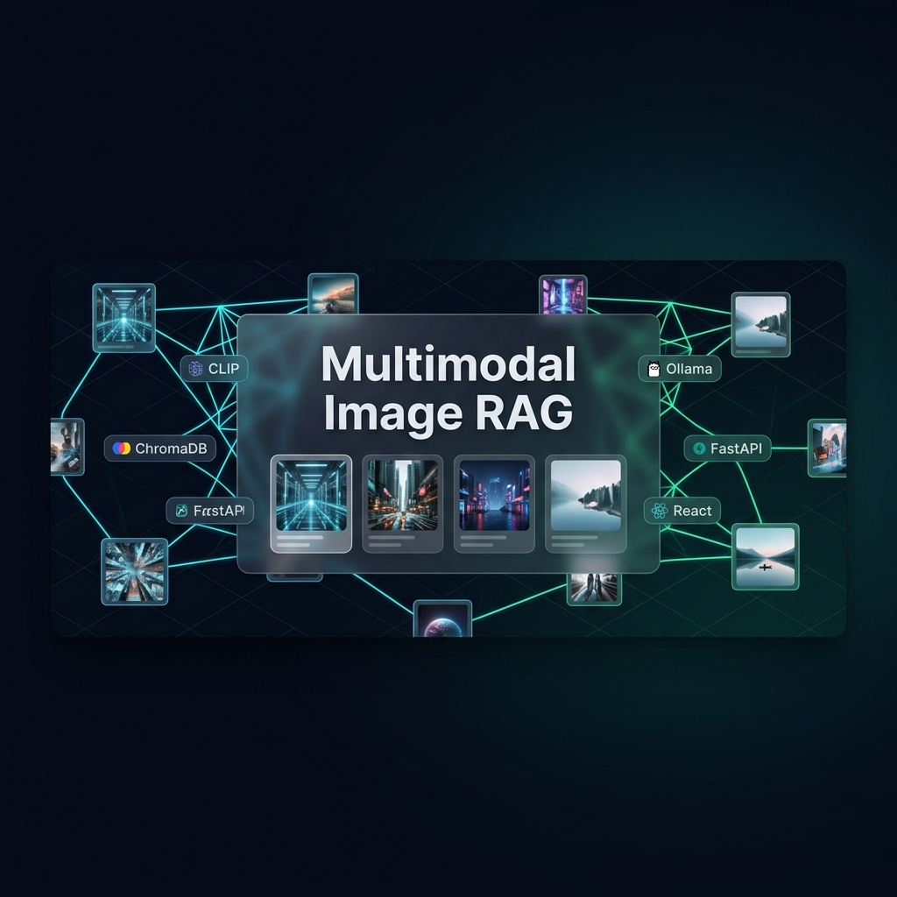

<div align="center">



<br/>

<h1>
  
</h1>

<p align="center">
  <strong>Production-grade Visual Intelligence Platform — Search images by language, find by visual similarity, and reason with local AI. Zero cloud dependency.</strong>
</p>

<br/>

<!-- Badges Row 1: Stack -->
<p align="center">
  
  
  
  
  
</p>

<!-- Badges Row 2: AI/ML -->
<p align="center">
  
  
  
  
</p>

<!-- Badges Row 3: Quality -->
<p align="center">
  
  
  
  
</p>

<br/>

<a href="#-quick-start">Quick Start</a> •
<a href="#-architecture">Architecture</a> •
<a href="#-features">Features</a> •
<a href="#-api-reference">API</a> •
<a href="#-tech-stack">Tech Stack</a> •
<a href="#-colab-demo">Colab Demo</a>

</div>

---

## What is Axithor VisionRAG Pro?

**Axithor VisionRAG Pro** is a fully-local, containerized multimodal Retrieval-Augmented Generation system purpose-built for visual intelligence workflows. It turns any image collection into a semantically searchable knowledge base — no cloud APIs, no data leakage, no rate limits.

Under the hood, every uploaded image is encoded into a 512-dimensional CLIP vector and stored in ChromaDB's HNSW index. At query time, your natural-language description is embedded by the same model and matched against the corpus with cosine similarity — returning ranked, visually meaningful results in milliseconds. For deeper understanding, one click routes the image to a local LLaVA vision model that describes, analyzes, and reasons in natural language.

> Built for ML researchers, full-stack engineers, and anyone who believes their data should stay theirs.

---

## Features

<table>
<tr>
<td width="50%">

### Core Intelligence
- **Text-to-Image Search** — Describe what you're looking for in plain English, get ranked visual results
- **Image-to-Image Similarity** — Upload a reference photo, find visually similar matches via cosine HNSW
- **Local LLaVA Reasoning** — Ask the AI to describe, analyze, or interpret any image
- **CLIP ViT-B/32 Embeddings** — 512-dim joint vision-language space, sub-100ms encoding

</td>
<td width="50%">

### Engineering Excellence
- **LRU-Cached Embeddings** — MD5-keyed 256-entry cache eliminates redundant CLIP calls
- **Async FastAPI** — Threadpool offload for CPU-bound ops, millisecond request tracking
- **HNSW Index Tuning** — ChromaDB M=16, ef=100 search, ef=200 construction
- **Retry Logic** — Exponential backoff on Ollama calls (3 attempts)

</td>
</tr>
<tr>
<td width="50%">

### Developer Experience
- **Interactive Swagger UI** — `/docs` auto-generated, fully typed Pydantic schemas
- **Docker Compose Stack** — One command spins up all 4 services
- **Health Endpoint** — Deep checks for ChromaDB + Ollama liveness
- **Google Colab Notebook** — Zero-setup demo with `MultiImageRAG_Colab.ipynb`

</td>
<td width="50%">

### UI/UX
- **Glassmorphism Dark Theme** — Backdrop blur, neon accents, fluid animations
- **Drag & Drop Upload** — Batch indexing with per-file progress bars
- **Similarity Score Display** — Every result shows cosine distance (0–1)
- **AI Analysis Sidebar** — LLaVA response rendered live, sticky panel beside results

</td>
</tr>
</table>

---

## Architecture

```
┌─────────────────────────────────────────────────────────────────────┐
│                    Docker Bridge Network: image-rag-net              │
│                                                                       │
│  ┌──────────────┐    REST/HTTP    ┌───────────────────────────────┐  │
│  │              │ ─────────────► │         FastAPI Backend        │  │
│  │  React + Vite│                │           Port: 8000           │  │
│  │  Frontend    │ ◄───────────── │                               │  │
│  │  Port: 5173  │   JSON/URLs    │  ┌─────────────────────────┐  │  │
│  └──────────────┘                │  │  CLIP ViT-B/32 Encoder  │  │  │
│                                  │  │  LRU Cache (256 entries) │  │  │
│                                  │  └────────────┬────────────┘  │  │
│                                  └───────────────┼───────────────┘  │
│                                                  │                   │
│                          ┌───────────────────────┼────────────────┐  │
│                          │                       │                │  │
│                          ▼                       ▼                │  │
│              ┌──────────────────┐    ┌──────────────────────┐    │  │
│              │    ChromaDB      │    │    Ollama (LLaVA)    │    │  │
│              │   Port: 8001     │    │    Port: 11434        │    │  │
│              │                  │    │                       │    │  │
│              │  HNSW Index      │    │  Vision Reasoning     │    │  │
│              │  Cosine Sim.     │    │  Natural Language     │    │  │
│              │  Persistent Vol  │    │  Analysis & Caption   │    │  │
│              └──────────────────┘    └──────────────────────┘    │  │
└─────────────────────────────────────────────────────────────────────┘
```

**Data Flow:**
```
Upload:  Image → PIL Validate → SHA256 Dedup → CLIP Encode → ChromaDB Store
Search:  Query → CLIP Embed → HNSW Cosine → Ranked Results → Frontend Gallery
Analyze: Image → Base64 → Ollama/LLaVA → Natural Language → AI Panel
```

---

## Tech Stack

<div align="center">

| Layer | Technology | Version | Role |
|-------|-----------|---------|------|
| **Frontend** | React | 18.2.0 | UI framework |
| **Build** | Vite | 5.2.11 | Bundler + HMR |
| **Styling** | Tailwind CSS | 3.4.4 | Utility-first CSS |
| **Routing** | React Router DOM | 6.30.3 | Client-side routing |
| **HTTP Client** | Axios | 1.7.2 | API calls + progress |
| **Icons** | Lucide React | 1.14.0 | SVG icon library |
| **Backend** | FastAPI | 0.111.0 | Async REST API |
| **Server** | Uvicorn | 0.30.1 | ASGI server |
| **Embeddings** | Transformers (HF) | 4.42.4 | CLIP model hosting |
| **Deep Learning** | PyTorch | 2.3.1 | Tensor operations |
| **CLIP Model** | `openai/clip-vit-base-patch32` | — | 512-dim embeddings |
| **Vector DB** | ChromaDB | 0.5.4 | HNSW cosine index |
| **Vision LLM** | Ollama + LLaVA | latest | Local visual reasoning |
| **Image Processing** | Pillow | 10.3.0 | Validation & transforms |
| **Config** | Pydantic-Settings | 2.3.4 | Env var management |
| **Containers** | Docker Compose | v2 | Multi-service orchestration |

</div>

---

## Quick Start

### Prerequisites

| Requirement | Minimum | Recommended |
|-------------|---------|-------------|
| RAM | 8 GB | 16 GB |
| Storage | 15 GB | 30 GB |
| Docker Engine | 24.x | latest |
| Docker Compose | v2 | latest |

### Option A: Docker Compose (Recommended)

```bash
# 1. Clone the repository
git clone https://github.com/jayaprakash2207/Axithor-VisionRAG-Pro-Multimodal-Image-Retrieval-Reasoning-System.git
cd Axithor-VisionRAG-Pro-Multimodal-Image-Retrieval-Reasoning-System

# 2. Configure environment
cp .env.example .env

# 3. Launch all 4 services
docker compose up --build -d

# 4. Pull the LLaVA vision model (one-time, ~4.7 GB)
docker exec image-rag-ollama ollama pull llava

# 5. Open the app
#    Frontend:     http://localhost:5173
#    API Docs:     http://localhost:8000/docs
#    Health Check: http://localhost:8000/health
```

> **First Run Note:** The backend downloads CLIP (`openai/clip-vit-base-patch32`, ~600 MB) from HuggingFace on startup. The health check has a 90-second grace period to accommodate this.

### Option B: Local Development (Without Docker)

**Backend**
```bash
cd backend
python -m venv .venv

# Windows
.venv\Scripts\activate
# Linux / macOS
source .venv/bin/activate

pip install -r requirements.txt
cp .env.example .env
uvicorn main:app --reload --port 8000
```

**Frontend**
```bash
cd frontend
npm install
cp .env.example .env    # set VITE_API_URL=http://localhost:8000
npm run dev
```

> Ensure ChromaDB and Ollama are running locally before starting.

### Option C: Google Colab

Open `MultiImageRAG_Colab.ipynb` in Google Colab for a zero-install demo — no local GPU required.

[](MultiImageRAG_Colab.ipynb)

---

## Usage Workflow

```
┌─────────────────────────────────────────────────────────────┐
│  Step 1: Build Your Knowledge Base                           │
│  ─────────────────────────────────────────────────────────── │
│  Go to Upload → Drag & drop any images (PNG, JPEG, WebP)    │
│  Each image is CLIP-encoded and indexed into ChromaDB.       │
│                                                               │
│  Step 2: Search Semantically                                 │
│  ─────────────────────────────────────────────────────────── │
│  Go to Search → Type a description  OR  Upload a query image │
│  Get ranked results with similarity scores in real-time.     │
│                                                               │
│  Step 3: Reason with AI                                      │
│  ─────────────────────────────────────────────────────────── │
│  Click "Analyze" on any result                               │
│  LLaVA generates a natural-language analysis in the sidebar. │
└─────────────────────────────────────────────────────────────┘
```

---

## API Reference

The backend exposes a fully-typed REST API. Explore it interactively at `http://localhost:8000/docs`.

<details>
<summary><b>POST /upload-image</b> — Index an image into ChromaDB</summary>

```http
POST /upload-image
Content-Type: multipart/form-data

file: <image file>  (PNG, JPEG, WebP | max 10 MB)
```

**Response:**
```json
{
  "id": "sha256_hash",
  "filename": "photo.jpg",
  "url": "/uploads/photo.jpg",
  "message": "Image indexed successfully"
}
```
</details>

<details>
<summary><b>POST /search-text-to-image</b> — Natural language image search</summary>

```http
POST /search-text-to-image
Content-Type: application/json

{
  "query": "a golden retriever playing on a beach",
  "top_k": 5
}
```

**Response:**
```json
{
  "results": [
    {
      "id": "...",
      "filename": "dog_beach.jpg",
      "url": "/uploads/dog_beach.jpg",
      "score": 0.923,
      "distance": 0.077
    }
  ]
}
```
</details>

<details>
<summary><b>POST /search-similar-images</b> — Image-to-image similarity</summary>

```http
POST /search-similar-images
Content-Type: multipart/form-data

file: <query image>
top_k: 5
```
</details>

<details>
<summary><b>POST /analyze-image</b> — LLaVA vision reasoning</summary>

```http
POST /analyze-image
Content-Type: application/json

{
  "filename": "photo.jpg",
  "prompt": "Describe the objects and scene in this image."
}
```

**Response:**
```json
{
  "analysis": "The image shows a sun-drenched beach scene with...",
  "model": "llava",
  "filename": "photo.jpg"
}
```
</details>

<details>
<summary><b>GET /health</b> — Deep service health check</summary>

```http
GET /health
```

```json
{
  "status": "healthy",
  "services": {
    "chromadb": "connected",
    "ollama": "connected"
  },
  "collection_count": 142
}
```
</details>

---

## Project Structure

```
Axithor-VisionRAG-Pro/
├── docker-compose.yml          # 4-service orchestration
├── .env.example                # Root environment template
├── MultiImageRAG_Colab.ipynb   # Google Colab demo
├── assets/
│   └── banner.png
│
├── backend/                    # FastAPI Python service
│   ├── main.py                 # App factory & CORS middleware
│   ├── requirements.txt
│   ├── Dockerfile              # Multi-stage Python 3.11 build
│   ├── api/
│   │   ├── routes.py           # 8 REST endpoints
│   │   └── schemas.py          # Pydantic request/response models
│   ├── services/
│   │   ├── clip_service.py     # CLIP encoding + LRU cache
│   │   ├── chroma_service.py   # ChromaDB CRUD + HNSW config
│   │   └── ollama_service.py   # LLaVA integration + retry logic
│   └── utils/
│       ├── config.py           # Pydantic-Settings env config
│       ├── image_utils.py      # Validation, B64, SHA256 dedup
│       └── logger.py           # Structured logging
│
└── frontend/                   # React + Vite SPA
    ├── src/
    │   ├── App.jsx             # Root component + routing
    │   ├── pages/
    │   │   ├── Home.jsx        # Landing page
    │   │   ├── Upload.jsx      # Drag-drop indexing
    │   │   └── Search.jsx      # Dual-mode search + AI panel
    │   ├── components/
    │   │   ├── SearchBar.jsx   # Text/image search tabs
    │   │   ├── Gallery.jsx     # Result grid
    │   │   ├── AiPanel.jsx     # LLaVA analysis sidebar
    │   │   ├── UploadDropzone.jsx
    │   │   └── ImageModal.jsx  # Fullscreen viewer
    │   └── services/
    │       └── api.js          # Axios client (7 methods)
    ├── vite.config.js
    └── tailwind.config.js
```

---

## Environment Variables

**Root `.env`**
```env
BACKEND_PORT=8000
FRONTEND_PORT=5173
CHROMA_PORT=8001
OLLAMA_PORT=11434
```

**Backend `.env`**
```env
APP_NAME=Axithor VisionRAG Pro
ENVIRONMENT=dev
LOG_LEVEL=INFO
ALLOWED_ORIGINS=http://localhost:5173

# ChromaDB
CHROMA_PATH=./vectordb_store
CHROMA_COLLECTION=image_rag

# Upload
UPLOAD_DIR=./uploads
MAX_UPLOAD_MB=10

# CLIP
CLIP_MODEL_NAME=openai/clip-vit-base-patch32

# Ollama
OLLAMA_BASE_URL=http://localhost:11434
OLLAMA_MODEL=llava
TOP_K=5
```

---

## Performance Characteristics

| Operation | Avg. Latency | Notes |
|-----------|-------------|-------|
| Image Upload + CLIP Encode | ~200–400 ms | GPU: ~50 ms |
| Text-to-Image Search (cached) | ~15 ms | LRU cache hit |
| Text-to-Image Search (cold) | ~120–200 ms | CLIP text encode |
| Image-to-Image Search | ~200–350 ms | CLIP image encode |
| LLaVA Analysis | ~5–30 sec | Depends on hardware |
| ChromaDB HNSW Query (5k vectors) | < 5 ms | ef=100 |

---

## Security & Privacy

- **100% Local** — No data ever leaves your machine. No telemetry, no API keys required.
- **Image Validation** — Only PNG, JPEG, WebP accepted. Max 10 MB enforced.
- **Path Traversal Protection** — Filename sanitization on all file-serving endpoints.
- **SHA256 Deduplication** — Prevents duplicate images from bloating the index.
- **Configurable CORS** — `ALLOWED_ORIGINS` controls which frontends can call the API.

---

## Roadmap

- [ ] **SigLIP Support** — Swap CLIP for Google's SigLIP for improved retrieval accuracy
- [ ] **Bulk Folder Upload** — Frontend UI for ingesting entire directories at once
- [ ] **Model Selection Dropdown** — Switch between `llava`, `bakllava`, `llava:13b` in-UI
- [ ] **Metadata Tagging** — Tag images at upload time, filter ChromaDB queries by metadata
- [ ] **GPU Acceleration** — CUDA Docker profile for faster CLIP inference
- [ ] **Export Collection** — Download indexed collection as JSON/parquet
- [ ] **Multi-Collection Support** — Organize images into named namespaces

---

## Contributing

Contributions are welcome! Please open an issue first to discuss major changes.

```bash
# Fork → Clone → Branch
git checkout -b feature/your-feature-name

# Make changes, then
git commit -m "feat: describe your change"
git push origin feature/your-feature-name
# Open a Pull Request
```

---

## License

This project is licensed under the **MIT License** — see [LICENSE](LICENSE) for details.

---

<div align="center">

**Built with passion for local-first AI**

<sub>CLIP • ChromaDB • LLaVA • FastAPI • React • Docker</sub>

<br/>


</div>
